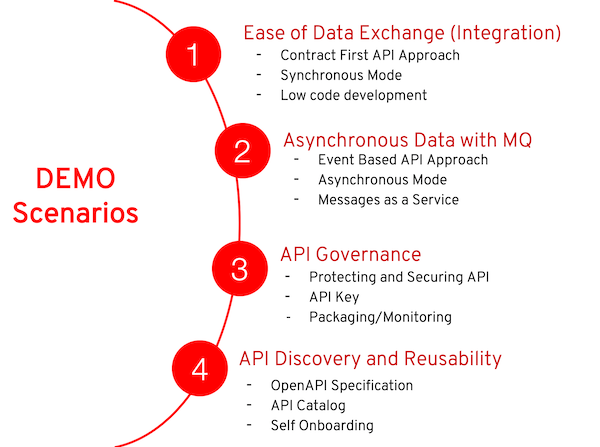

# 3scale 2.6 Migration Guide 

This repository includes the some backup & restore scripts and infrastructure for Migrating 3scale 2.6 Template based (OCP 3.11) to 3scale 2.6 Operator based (OCP4.6)

1. Back up from 3scale 2.6 Template based on OCP 3.11
2. Update the THREESCALE_SUPERDOMAIN value
3. Install 3scale 2.6 operator on OCP 4.6
4. Restore secrets and configmaps to OCP 4.6
5. Restore the remaining data
6. Update the domain values in rails console and resync
7. Update the Staging and Production APICast URL using Admin Portal

<!--
* [Introduction](#introduction)
* [Deploy on RHPDS](#deploy-on-rhpds)
* [Demo Guide](#demo-guide)

## Introduction

There are 4 modules in this demo:



## Deploy on RHPDS

Provision your OpenShift environment via the service catalog under **Workshops &rarr; OpenShift 4.4 Workshop**.

## Automated Deploy on OpenShift
You can use the `provision.sh` script provided to deploy the entire demo:

  ```
  ./provision.sh deploy
  ```
You will need to provide the following when provisioning:

* OpenShift Wildcard Domain
* Registry Service Account Username
* Registry Service Account Password

4 OpenShift projects will be created:

* 3scale-project : contains 3scale application
* fuse-online : contains fuse online application
* amq-online : contains amq online application
* demo-project : contains microservices applications

## Demo Parameters

* Take note of these credentials below:

  * PostgreSQL: `demouser/demo123`
  * 3scale: `admin/demo123`
-->